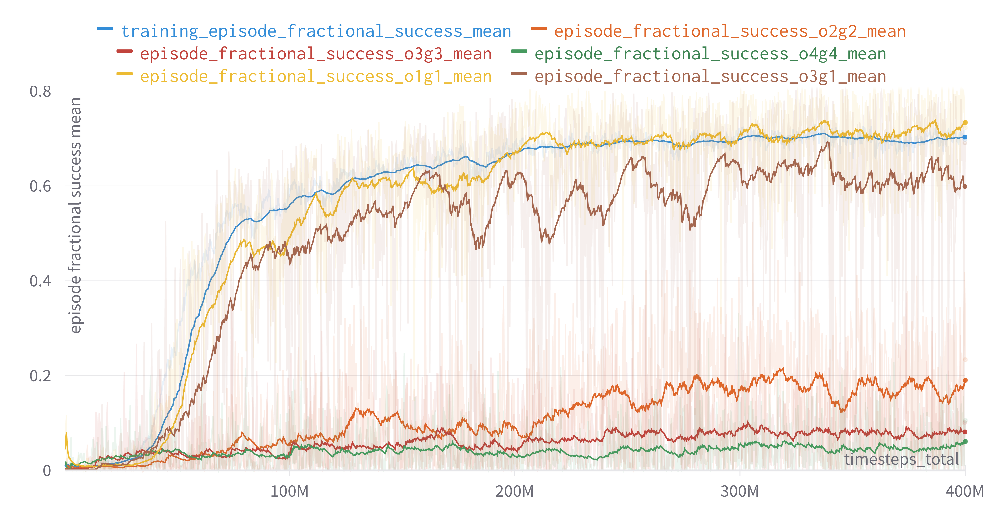
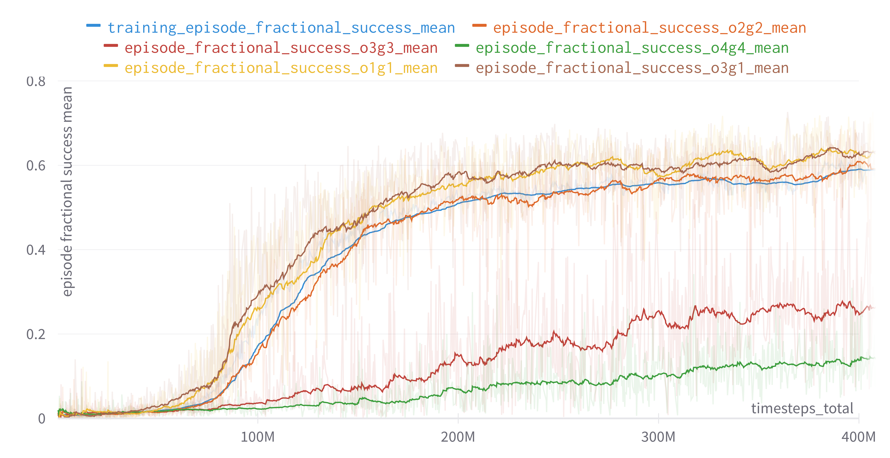

# Materials for visualization of the Master thesis: Multi-Target Multi-Object Manipulation using Relational Deep Reinforcement Learning

Repository containing media files for the thesis. Access under the `experiments` folder. Some selected visualizations below:

# Experiment 1 (2o1g)
### Training curve

### OOD

https://user-images.githubusercontent.com/63565275/190024367-10cb34a4-7480-4491-a894-a953903728f0.mp4

https://user-images.githubusercontent.com/63565275/190024373-388608c9-2591-4ace-82ac-8d04e8d07319.mp4

# Experiment 2 (3o2g)
### Training curve

### Training Videos
https://user-images.githubusercontent.com/63565275/190024388-e200a426-82a5-47c2-8dc7-18dddcae780d.mp4

### OOD

https://user-images.githubusercontent.com/63565275/190024413-0e7062d6-2040-42e1-96ee-6fc0e728f8f3.mp4

https://user-images.githubusercontent.com/63565275/190024423-5fdaf717-57f2-418a-a6e2-97de75449442.mp4

# Experiment 3 (Curriculum to 5o4g)
### Training  curve

### Training Curriculum Videos
https://user-images.githubusercontent.com/63565275/190024475-280bdf62-7707-4777-9c62-6ce611ed22a3.mp4

https://user-images.githubusercontent.com/63565275/190024478-5d9043f4-143d-474f-ab5a-6869b52524e1.mp4

### OOD

https://user-images.githubusercontent.com/63565275/190024507-b24e72a8-41ca-4eb4-9c1a-0354c3a01aa4.mp4

https://user-images.githubusercontent.com/63565275/190024511-755a7a67-4a84-4dca-9343-f2b2c5914201.mp4

